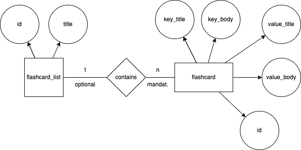
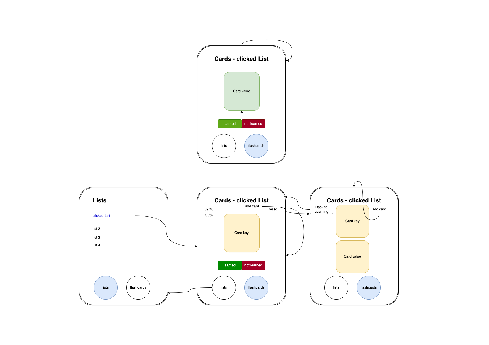

# Setup
```bash
    git clone https://github.com/MisterLs4566/flashcard-template-react.git

    cd server
    npm install
    npm run start
```

```bash
    cd ..
    cd client
    npm install
    npm run dev
```

Now you can open the url: 
```plaintext 
localhost:3000
```

# Data Model
I used the following entity-relationship diagram for the modelling the database:

Out of this, the following relational model can be developed:
- flashcard_list( <ins>flashcard_list_id</ins>, title )
- flashcard( <ins>flashcard_id</ins>, key_title, key_body, value_title, value_body, ↑flashcard_list )
# UI Mockup
The following image shows the first UI mockup for the web app.
